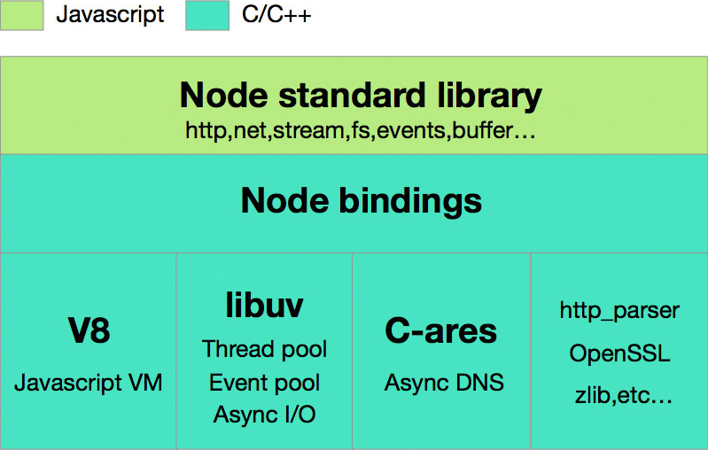
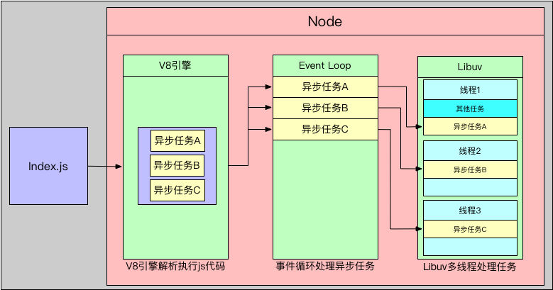
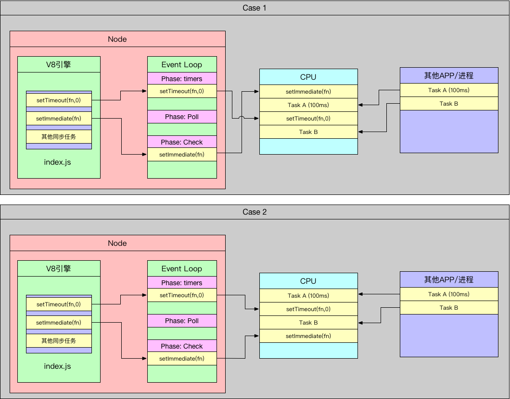

<!-- @import "[TOC]" {cmd="toc" depthFrom=1 depthTo=6 orderedList=false} -->

<!-- code_chunk_output -->

- [Node Event Loop 学习记录](#node-event-loop-学习记录)
  _ [一、Node 架构](#一-node-架构)
  _ [二、Event Loop](#二-event-loop)
  _ [1. 什么是事件(Event)](#1-什么是事件event)
  _ [2. 什么是 Event Loop](#2-什么是-event-loop)
  _ [3. 阶段细节](#3-阶段细节)
  _ [Timers 阶段](#timers-阶段)
  _ [I/O(pending) Callbacks 阶段](#iopending-callbacks-阶段)
  _ [poll 阶段](#poll-阶段)
  _ [check 阶段](#check-阶段)
  _ [close callbacks 阶段](#close-callbacks-阶段)
  _ [4. setImmediate()和 setTimeout()](#4-setimmediate和-settimeout)
  _ [例子](#例子) \* [参考链接](#参考链接)

<!-- /code_chunk_output -->

# Node Event Loop 学习记录

## 一、Node 架构

Node.js 主要分为四大部分，Node Standard Library，Node Bindings，V8 引擎，Libuv(EventLoop)，架构图如下:



- **Node Standard Library**: Node 提供的基础类库，例如 http,fs,buffer,net 等。
- **Node Bindings**: 负责 JS 与 C++代码的沟通，封装 V8 引擎和 Libuv 库，给 Node Standard Library 提供 API 支持。
- **Node 底层 Node 主要运行层，本层是由 C/C++代码实现**
  - **V8 引擎**: 由 Google 开发维护的 Javascript 引擎，负责解析执行 Javascript 代码。
  - **Libuv**: Libuv 是一个高性能的，事件驱动的 I/O 库，提供跨平台抽象层，针对不同的操作系统封装，提供统一的 API。Node 的异步非阻塞 I/O 实际上是由 Libuv 实现的。
  - **C-ares**: 提供异步处理 DNS 的能力。
  - **Http_parser,OpenSSLz,lib 等**: 提供包括 http 解析、SSL、数据压缩等其他的能力。

**Node 运行顺序如下**：

1. V8 引擎解析 JS 代码。
2. 解析后的代码调用 Node API。
3. Libuv 负责 Node API 执行，将不同的任务放入不同的线程，形成一个 Event Loop，并以异步的方式将任务的执行结构返回给 V8 引擎。
4. V8 引擎将结果返回给用户。

本文主要目的是为了理清**Event Loop 阶段**(也就是上面介绍的第三阶段)发生的事情。

## 二、Event Loop

### 1. 什么是事件(Event)

事件是一种可以被侦测到的行为，并且允许用户自定义处理该事件。例如：

```javascript {.line-numbers}
// 设置一个定时器，在指定时间之后执行某个操作。
setTimeout(() => {
  console.log("Fired");
}, 1000);
```

```javascript {.line-numbers}
// 异步操作Http请求完成。
Promise.then(() => {
  console.log("Http request completed");
});

// 异步操作读取文件完成。
fs.readFile(path, () => {
  console.log("Read file completed");
});
```

可以观察到所有事件的处理都是在回调函数中进行的，所以，**_Event Loop 主要处理任务是管理这些回调函数的执行顺序_**，理解 Event Loop 可以帮助我们写出更加可靠的代码。

### 2. 什么是 Event Loop

Node 是基于 Javascript 实现的，但是 Javascript 本身是单线程的，并不支持多线程，一旦遇到大量耗时任务阻塞了 Javascript，那将是一场灾难。为了解决这个问题，Node 使用了一种叫做 Event Loop 的技术，Node 将这些耗时的，会阻塞 Javascript 线程的任务交由 Event Loop 来处理，当 Event Loop 处理完成之后，通知 Javascript 处理该事件对应的回调。这样，Node 就拥有了多线程处理事件的能力。

Node 将异步任务交给 Libuv 执行，Libuv 本身是多线程的，可以将不同的异步任务放到不同的线程处理，在任务完成之后通知 Javascript 处理该任务对应的事件。



当一个 Node 应用启动之后，它会初始化 Event Loop，V8 引擎开始解析并执行 js 代码，遇到异步任务，将其放入到 Event Loop 执行，Event Loop 会根据异步任务的类型，分发到不同的 Libuv 线程中执行。

Event Loop 分为六个阶段：

```
   ┌────────────────────────────────┐
┌─>│        timers                  │
│  └──────────┬─────────────────────┘
│  ┌──────────┴─────────────────────┐
│  │     I/O(pending) callbacks     │
│  └──────────┬─────────────────────┘
│  ┌──────────┴─────────────────────┐
│  │     idle, prepare              │
│  └──────────┬─────────────────────┘      ┌───────────────┐
│  ┌──────────┴─────────────────────┐      │   incoming:   │
│  │         poll                   │<─────┤  connections, │
│  └──────────┬─────────────────────┘      │   data, etc.  │
│  ┌──────────┴─────────────────────┐      └───────────────┘
│  │        check                   │
│  └──────────┬─────────────────────┘
│  ┌──────────┴─────────────────────┐
└──┤    close callbacks             │
   └────────────────────────────────┘
```

每个阶段都有一个执行 callback 的 FIFO 队列，直到队列中的 callback 被清空或达到最多执行次数限制之后，才会进入下一个阶段。

**阶段概述：**

1. **timers**：执行 setTimeout 和 setInterval 的回调。
2. **I/O(pending) Callbacks**：处理一些上一轮循环中的少数未执行的 I/O 回调。
3. **idle, prepare**：Node 内部使用。
4. **poll**：
   4.1 检查新的 I/O 事件。
   4.2 执行除了 close callbacks，定时器回调和 setImmediate 之外的所有回调。
   4.3 Node 会在适当的时候阻塞。
5. **check**：执行 setImeediate 的回调。
6. **close callbacks**：一些 close callbacks。例如 socket.on('close', ...)。

### 3. 阶段细节

#### Timers 阶段

定时器会指定执行回调的等待时间，一旦到期，timers 会尽可能早一点执行定时器的回调，这个“早”是相对的，取决于操作系统当前执行的任务，分两种情况：
_假设定时器设置的等待时间为 x_ 1.如果到达定时器的等待时间，操作系统中没有其他任务在执行，可以立即执行定时器指定的回调。_实际等待时间为 x_。 2.如果到达定时器的等待时间，操作系统有其他任务正在执行，那么 timers 队列需要等待操作系统的其他任务执行完成之后，才可以开始执行 timers 中的回调，这时候实际等待的时间就会比预设的时间长。_实际等待时间为 x+n_。
所以，timers 只能保证尽可能的早去执行定时器的回调。

```
Note：严格意义上说，是Poll阶段决定了什么时候执行timers阶段的内容。
```

#### I/O(pending) Callbacks 阶段

该阶段执行一些系统的回调，例如 TCP 错误事件。

#### poll 阶段

poll 阶段有两个主要功能：

1. 当 timers 中的定时器到时后，执行指定的回调。
2. 处理 poll 队列中的事件。

当进入到 poll 阶段，timers 队列中没有设置定时器。会发生下列两种情况之一：

- 如果 poll 队列不为空，event loop 会同步的迭代执行 poll 队列的回调，直到 poll 队列为空或者达到执行次数上限为止。
- 如果 poll 队列为空，会发生下列两种情况之一：
  - 如果设置了 setImmediate()，event loop 会结束 poll 阶段，进入 check 阶段，执行相应的回调。
  - 如果没有设置 setImmediate()，event loop 会等待其他的回调被添加到 poll 队列，新添加的回调会立即执行。

一旦 poll 队列为空，event loop 将在 timers 队列中寻找到期的定时器，如果有一个或多个定时器到期，event loop 会回到 timers 阶段执行到期的回调。

#### check 阶段

一旦 poll 阶段完成，本阶段的队列中的回调会立即执行。
实际上，setImmediate()是一个特殊的定时器，它使用 libuv 的 api 来调度执行回调。
通常，随着代码的执行，event loop 最终会进入 poll 阶段等待新事件的到来。但是，如果存在 setImmediate()回调，并且 poll 处于空闲状态，poll 会结束等待进入 check 阶段。

#### close callbacks 阶段

如果一个 socket 或者 handle 突然关闭（比如：socket.destory()），close 事件就会被提交到这个阶段。否则它将会通过 process.nextTick()触发。

### 4. setImmediate()和 setTimeout()

setImmediate()和 setTimeout()看起来比较相似，但是行为缺不相同，这取决于何时调用它们：

- setImmediate()是在 poll 阶段结束后，进入 check 阶段时调用。
- setTimeout()是在 poll 阶段空闲时，且 timers 中的定时器到期后调用。

来看一段代码：

```javascript {.line-numbers}
// timeout_vs_immediate.js
setTimeout(() => {
  console.log("timeout");
}, 0);

setImmediate(() => {
  console.log("immediate");
});
```

执行结果如下：

```javascript
$ node timeout_vs_immediate.js
timeout
immediate

$ node timeout_vs_immediate.js
immediate
timeout
```

如果在主模块调用这两个方法，二者的执行顺序是不确定的，看图：

首先，Node 源码中有个逻辑处理，setTimeout(fn, 0) => setTimeout(fn, 1)，也就是说，即便设置了 timeout 的最小等待时间为 0ms，也会被 node 处理成等待 1ms，这个是我们没法改变的。

V8 引擎解析执行 js 代码，将异步操作交由 event loop 处理，然后 event loop 将任务提交给 cpu 去执行。由于 CPU 是为整个操作系统服务器的，所以，CPU 同时还可能在运行其他应用，在这样的条件下，就可能有两种情况发生：
**Case 1**：当 event loop 申请 CPU 执行代码的时候，CPU 正在执行其他应用的任务，event loop 需要等待其他任务执行完成，100ms 过去，event loop 获得 CPU 资源，执行 Poll 阶段回调，我们代码中没有其他异步任务，所以 Poll 队列为空，按照 Poll 阶段执行逻辑，发现 timers 中有到期的定时器，执行 setTimeout 的回调，然后进入 Poll 阶段，Poll 进入空闲状态，发现有 setImmediate，进入 check 阶段执行 setImmediate 的回调。所以，setTimeout 先于 setImmediate 执行。
**Case 2**: 当 event loop 申请 CPU 执行代码的时候，CPU 处于空闲状态，event loop 立即获得 CPU 资源，执行 Poll 阶段代码，我们代码中没有其他异步任务，所以 Poll 队列为空，按照 Poll 阶段执行逻辑，检查 timers 中的定时器，发现没有到期的定时器，Poll 进入空闲状态，发现有 setImmediate，进入 check 阶段执行回调，执行完毕之后进入 Poll 阶段，等待其他 I/O 事件，并检查 timers 中的定时器是否到期，一旦 timers 中的定时器到期，立即执行 setTimeout 的回调。所以，setImmediate 先于 setTimeout 执行。

### 例子

好
为了更好的理解上面各个阶段，我们来看下面的例子：

```javascript {.line-numbers}
/// 单纯的
const fs = require("fs");

function someAsyncOperation(callback) {
  // Assume this takes 95ms to complete
  fs.readFile("/path/to/file", callback);
}

const timeoutScheduled = Date.now();

setTimeout(() => {
  const delay = Date.now() - timeoutScheduled;

  console.log(`${delay}ms have passed since I was scheduled`);
}, 100);

// do someAsyncOperation which takes 95 ms to complete
someAsyncOperation(() => {
  const startCallback = Date.now();

  // do something that will take 10ms...
  while (Date.now() - startCallback < 10) {
    // do nothing
  }
});
// 111ms have passed since I was scheduled
```

## 参考链接

https://github.com/yjhjstz/deep-into-node/blob/master/chapter1/chapter1-0.md

https://segmentfault.com/a/1190000017893482#articleHeader4
